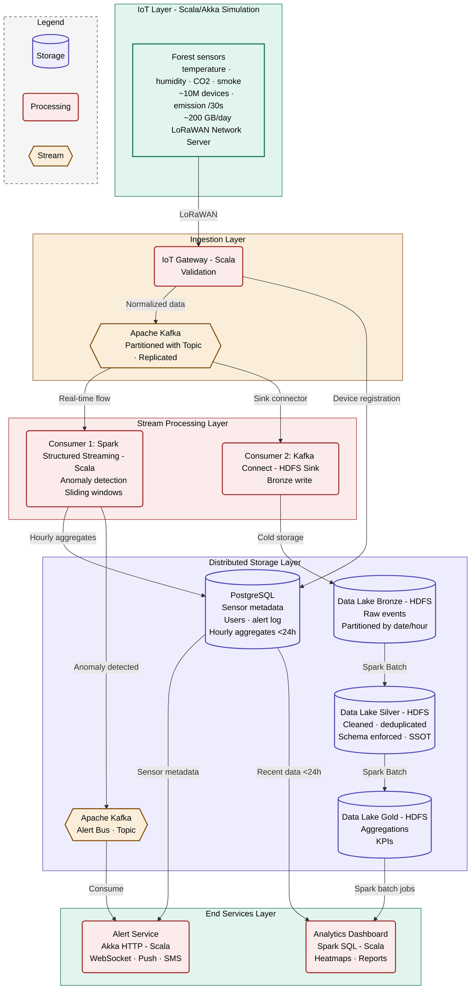

# Forest Fire Detection - Data Architecture

> Big Data Engineering and Architecture - Preliminary Architecture Report

## Context

Our startup operates a network of IoT sensors deployed across forests to detect wildfires in real time. Each sensor emits, every 30 seconds, a payload containing `timestamp`, `device_id`, `latitude`, `longitude`, and environmental measurements (temperature, humidity, CO2, smoke level). At target scale, the system supports **~10 million devices** producing roughly **200 GB of data per day** (~73 TB per year).

The information system must provide two services with conflicting constraints:

- **Alert service** : sub-second detection and notification of fire-prone conditions.
- **Long-term analytics service** : historical analysis and government reporting.

This document answers the preliminary architecture questions and presents the proposed system design.

---

## Preliminary questions

### 1.a - Storage constraints for long-term analytics

To handle long-term analytics on ~200 GB/day (~73 TB/year), the storage layer must meet the following technical and business constraints:

**Horizontal scalability (volume).** Vertical scaling (buying a single more powerful server) hits both cost and physical limits at this scale. The storage layer must scale by adding commodity nodes to the cluster without service interruption, absorbing years of historical data linearly.

**High write throughput (velocity).** With ~10M devices emitting every 30 seconds, the storage layer must sustain a write rate of roughly 333k events/second without creating a bottleneck upstream of the ingestion pipeline.

**Analytical query capability (OLAP).** Unlike OLTP systems optimized for short transactions, the analytics workload requires efficient scans, aggregations, and joins over large historical windows (e.g. *"average temperature per geographic zone over the last 3 years"*). This favors columnar formats and distributed query engines.

**Fault tolerance and durability.** Hardware failures are statistically inevitable: a single disk fails on average every 900 days, so on a 100-node cluster, multiple failures occur each month. The storage layer must replicate data across nodes so that the loss of any single component (disk, server, rack) does not result in data loss or service disruption. Environmental data is also subject to regulatory retention requirements, reinforcing the durability constraint.

### 1.b - Components required

Two complementary storage components are needed:

**1. A distributed file system as Data Lake - HDFS.**
Stores raw and processed data in a cost-effective, durable, massively scalable way. We adopt the medallion architecture:
- **Bronze** : raw events as ingested, partitioned by date/hour, used for replay and audit.
- **Silver** : cleaned, deduplicated, schema-enforced data in Parquet. This layer is the Single Source of Truth (SSOT) for all downstream analytics.
- **Gold** : pre-aggregated, use-case-specific views ready for dashboards and reporting.

**2. A relational database for metadata and recent data - PostgreSQL.**
A small but critical fraction of the data (sensor registry, user accounts, alert acknowledgment logs) requires strong ACID guarantees (atomicity, consistency, isolation, durability). The volume is low (thousands of rows), so PostgreSQL's lack of horizontal scalability is not a limitation here. It complements the BASE-oriented storage above by providing referential integrity and transactional safety for operational metadata. The IoT Gateway writes device registrations (device_id, latitude, longitude, owner, contact) into PostgreSQL at provisioning time; the Alert Service writes alert acknowledgment logs. For sub-day queries (e.g. *"history of zone X over the last 24 hours"*), Spark writes hourly aggregates into PostgreSQL, keeping the volume manageable.

### 2.a - Constraints for the alert service

The alert service addresses a critical life-safety requirement and is bound by three non-negotiable constraints:

**Very low latency.** The delay between anomaly detection and alert delivery must remain under one second end-to-end. A delayed wildfire alert can cost lives, property, and ecosystems.

**High availability.** The alert pipeline cannot go offline. Even during partial failures (broker crash, network partition), alerts must keep flowing. Under the CAP theorem, the alert components must favor Availability over strict Consistency, a slightly stale alert is acceptable; a missing alert is not.

**Stream processing.** Data must be analyzed in flight, in memory, as it arrives - writing to disk first and querying later is incompatible with sub-second targets. The processing engine must consume events continuously and apply detection rules on sliding time windows.

### 2.b - Components required

The alert pipeline relies on three complementary components:

**1. A distributed message broker - Apache Kafka.**
Kafka ingests millions of real-time sensor events, partitions them by `geohash` for parallel processing, replicates each partition across multiple brokers, and absorbs traffic spikes without data loss. It also decouples producers (sensors) from consumers (processors), so the alert pipeline and the cold storage pipeline can evolve and scale independently.

**2. A stream processing engine - Spark Structured Streaming (Scala).**
Spark Structured Streaming continuously consumes the Kafka topic, applies detection rules over sliding windows (e.g. *temperature > 50°C AND CO level > 100 ppm AND rising trend over 5 minutes → fire alert*), and emits anomalies into a dedicated Kafka topic (`alerts`). Same engine, same language (Scala), and same cluster as the batch jobs, which simplifies operations.

**3. The Alert Service - Akka HTTP (Scala).**
Subscribes to the `alerts` Kafka topic, enriches each alert with sensor metadata pulled from PostgreSQL (location, owner, contact for the zone), and dispatches notifications to emergency services via different methods. Built on the Akka actor model for non-blocking, fault-tolerant handling of many concurrent connections.

---

## Proposed Architecture

The system is organized in five layers: IoT simulation, ingestion, stream processing, distributed storage (including the Kafka alert bus), and end services.

