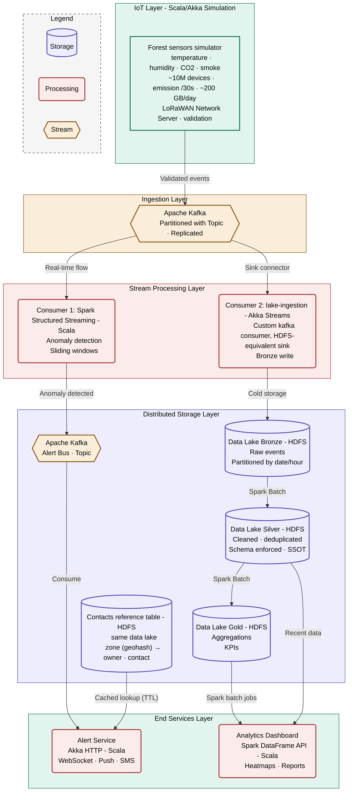

# Forest Fire Detection - Data Architecture

> Big Data Engineering and Architecture - Preliminary Architecture Report

## Context

Our startup operates a network of IoT sensors deployed across forests to detect wildfires in real time. Each sensor emits, every 30 seconds, a payload containing `timestamp`, `device_id`, `latitude`, `longitude`, and environmental measurements (temperature, humidity, CO2, smoke level). At target scale, the system supports **~10 million devices** producing roughly **200 GB of data per day** (~73 TB per year).

The information system must provide two services with conflicting constraints:

- **Alert service** : sub-second detection and notification of fire-prone conditions.
- **Long-term analytics service** : historical analysis and government reporting.

This document answers the preliminary architecture questions and presents the proposed system design.

---

## Preliminary questions

### 1.a - Storage constraints for long-term analytics

To handle long-term analytics on ~200 GB/day (~73 TB/year), the storage layer must meet the following technical and business constraints:

**Horizontal scalability (volume).** Vertical scaling (buying a single more powerful server) hits both cost and physical limits at this scale. The storage layer must scale by adding commodity nodes to the cluster without service interruption, absorbing years of historical data linearly.

**High write throughput (velocity).** With ~10M devices emitting every 30 seconds, the storage layer must sustain a write rate of roughly 333k events/second without creating a bottleneck upstream of the ingestion pipeline.

**Analytical query capability (OLAP).** Unlike OLTP systems optimized for short transactions, the analytics workload requires efficient scans, aggregations, and joins over large historical windows (e.g. *"average temperature per geographic zone over the last 3 years"*). This favors columnar formats and distributed query engines.

**Fault tolerance and durability.** Hardware failures are statistically inevitable: a single disk fails on average every 900 days, so on a 100-node cluster, multiple failures occur each month. The storage layer must replicate data across nodes so that the loss of any single component (disk, server, rack) does not result in data loss or service disruption. Environmental data is also subject to regulatory retention requirements, reinforcing the durability constraint.

### 1.b - Components required

The storage layer is built on a single distributed file system (HDFS), which keeps the whole layer scalable and durable while serving two distinct purposes:

**1. A distributed file system as Data Lake - HDFS.**
Stores raw and processed data in a cost-effective, durable, massively scalable way. We adopt the medallion architecture:
- **Bronze** : raw events as ingested, partitioned by date/hour, used for replay and audit.
- **Silver** : cleaned, deduplicated, schema-enforced data in Parquet. This layer is the Single Source of Truth (SSOT) for all downstream analytics.
- **Gold** : pre-aggregated, use-case-specific views ready for dashboards and reporting.

**2. A contacts reference table inside the Data Lake - HDFS.**
The Alert Service needs to map each incident to the right recipients (owner, emergency contact for the zone). Rather than introducing a separate transactional database - which would be the only non-distributed, non-scalable component in the system and would add a synchronous network hop on the critical alert path - we store this small reference table directly in the Data Lake. The table is keyed by zone (`geohash`) and holds `owner` and `contact`.

Because contacts are reference data that changes rarely, the Alert Service loads this table into an in-memory cache with a TTL: lookups stay in-memory (preserving sub-second latency), and a new or updated entry becomes visible once the TTL expires, without restarting any instance. This keeps the entire storage layer distributed and scalable, and avoids coupling the high-velocity pipeline to a single-node database. For the PoC the table is a static seed written once into the same HDFS data lake as the sensor data, so no provisioning service is involved; the TTL-refresh design is simply what would let it evolve without redeploying.

The device geolocation needed at alert time is already carried in every drone message (`device_id`, `latitude`, `longitude`), so no separate device registry or provisioning service is required. To maintain a pure separation between operational and analytical workloads, all short-term and long-term analytical queries are routed to the HDFS Data Lake (Silver/Gold layers) through Spark's DataFrame API.

### 2.a - Constraints for the alert service

The alert service addresses a critical life-safety requirement and is bound by three non-negotiable constraints:

**Very low latency.** The delay between anomaly detection and alert delivery must remain under one second end-to-end. A delayed wildfire alert can cost lives, property, and ecosystems.

**High availability.** The alert pipeline cannot go offline. Even during partial failures (broker crash, network partition), alerts must keep flowing. Under the CAP theorem, the alert components must favor Availability over strict Consistency, a slightly stale alert is acceptable; a missing alert is not.

**Stream processing.** Data must be analyzed in flight, in memory, as it arrives - writing to disk first and querying later is incompatible with sub-second targets. The processing engine must consume events continuously and apply detection rules on tumbling time windows.

### 2.b - Components required

The alert pipeline relies on three complementary components:

**1. A distributed message broker - Apache Kafka.**
Kafka ingests millions of real-time sensor events, partitions them by `device_id` (the message key) for parallel processing while keeping each device's readings ordered, replicates each partition across multiple brokers, and absorbs traffic spikes without data loss. It also decouples producers (sensors) from consumers (processors), so the alert pipeline and the cold storage pipeline can evolve and scale independently.

**2. A stream processing engine - Spark Structured Streaming (Scala).**
Spark Structured Streaming continuously consumes the Kafka topic, applies detection rules over tumbling windows (a device is flagged when, within one window, *max temperature > 50°C AND max smoke > 50 AND max CO2 > 600 ppm AND min humidity < 30% → fire alert*), and emits anomalies into a dedicated Kafka topic (`alerts`). Same engine, same language (Scala), and same cluster as the batch jobs, which simplifies operations.

**3. The Alert Service - Akka HTTP (Scala).**
Subscribes to the `alerts` Kafka topic, enriches each alert with the recipient metadata (owner, contact for the zone) resolved from the TTL-cached contacts table described in 1.b, and dispatches notifications to emergency services via different methods. The device location is already present in the alert payload, so enrichment is a pure in-memory lookup with no synchronous database call on the critical path. Built on the Akka actor model for non-blocking, fault-tolerant handling of many concurrent connections.

---

## Proposed Architecture

The system is organized in five layers: IoT simulation, ingestion, stream processing, distributed storage (including the Kafka alert bus), and end services.

---

## Dashboard & gold endpoint (PoC simplification)

In the target architecture above, the **Analytics Dashboard** is a separate end service. In the PoC we do not stand up a second web server for it: the Alert Service already runs an Akka HTTP server for the `/alerts` WebSocket and `/health`, so it also serves the monitoring page (`dashboard.html`) and a read-only `/gold` endpoint.

`/gold` performs **no computation** — it simply reads the `gold-summary.json` file produced by the `analytics` batch job in the data lake (`$DATA_LAKE_ROOT/gold/`) and returns it as-is, so the dashboard can render the gold panels alongside the live alert stream. The alert path itself never touches the gold data.

This keeps the demo to a single HTTP server. In a real deployment, serving the dashboard and the gold aggregations would move to the dedicated Analytics Dashboard service, leaving the Alert Service with only `/alerts` and `/health`.
